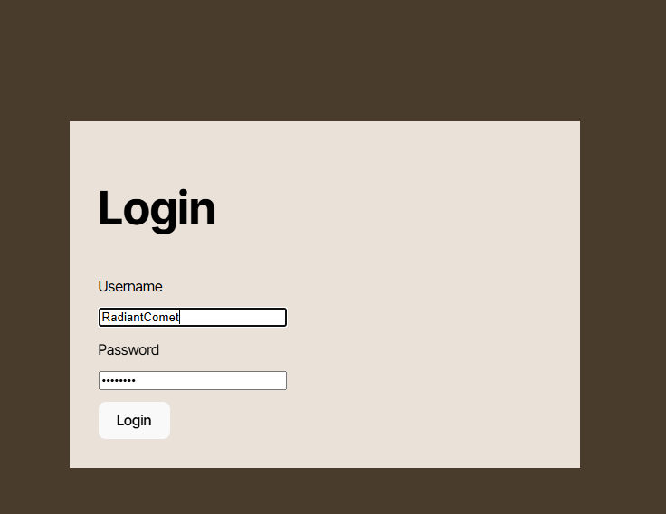

# Krazy-Kanban-Board

## Description
A full-stack Kanban Board application where users can create, update, and track tickets for various tasks in different projects statuses such as *Todo*, *In Progress*, and *done*. This app provides user authentication via JWT and allows users to manage their tasks efficiently.

[Click here](link here render) to test the application!



## Table of Contents

- [Installation](#installation)
- [Usage](#usage)
- [Credits](#credits)
- [License](#license)

## Installation

For installation follow these steps:

1) Clone the repo to your local machine with git clone
2) Install the dependencies on both client-side & server-side: `npm install`.
3) Create a `.env` file in your server directory and add the following:
```sh
DB_NAME='your_db_name'
DB_USER='your_db_user'
DB_PASSWORD='your_db_password'
JWT_SECRET_KEY='your_jwt_secret_key'
```
4) Create your PostgresSQL database `psql -U postgres -f db/schema.sql` 
5) Seed the database:
- npm run server:build
- npm run seed

## Usage
* On the main root directory run `npm run start:dev`.
* To Login use one of the examples located on server/seeds/user-seeds.ts.
* Once logged in you are presented (details about the website)

It should be presented like the picture below:

[picture here](image here)

## Credits
N/A 
## License

This application is covered under [](https://opensource.org/licenses/MIT)

## Features

User authentication (Login/Logout) using JWT
CRUD functionality for tickets (Create, Read, Update, Delete)
Ticket statuses: Todo, In Progress, and Done
Responsive UI built with React
RESTful API for backend operations using Express and Sequelize ORM
Technologies Used
Frontend: React, Vite, TypeScript, CSS
Backend: Express, TypeScript, Sequelize, PostgreSQL
Authentication: JWT (JSON Web Tokens)
Database: PostgreSQL
Getting Started
Prerequisites
Node.js (v14 or higher)
PostgreSQL
Yarn or npm (for managing packages)

## How to Contribute

If you created an application or package and would like other developers to contribute it, you can include guidelines for how to do so. The [Contributor Covenant](https://www.contributor-covenant.org/) is an industry standard, but you can always write your own if you'd prefer.

## Tests

Go the extra mile and write tests for your application. Then provide examples on how to run them here.