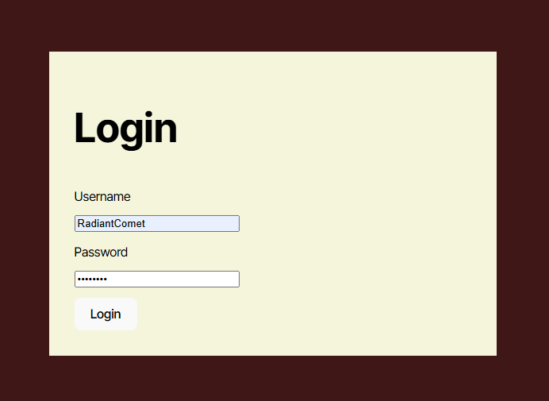
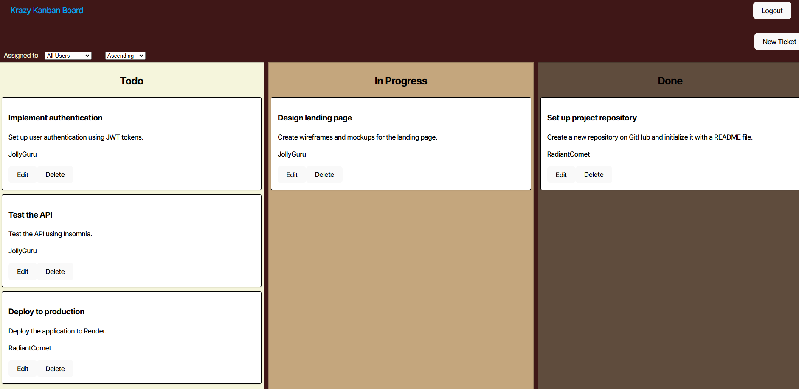

# 📝Krazy-Kanban-Board

## Description
A full-stack Kanban Board application where users can create, update, and track tickets for various tasks in different projects statuses such as *Todo*, *In Progress*, and *done*. This app is provided with **JWT authentication**, built using **React**, **TypeScript**, **Express**, **PostgreSQL**, and **Sequelize**. Users can log in, manage tasks, and track their progress in different status columns.

        to test the application!



## Table of Contents

- [Installation](#installation)
- [Usage](#usage)
- [Contributor](#contributor)
- [License](#license)
- [features](#features)

## Installation

For installation follow these steps:

1) Clone the repo to your local machine with git clone
2) Install the dependencies on both client-side & server-side: `npm install`.
3) Create a `.env` file in your server directory and add the following:
```sh
DB_NAME='your_db_name'
DB_USER='your_db_user'
DB_PASSWORD='your_db_password'
JWT_SECRET_KEY='your_jwt_secret_key'
```
4) Create your PostgresSQL database `psql -U postgres -f db/schema.sql` 
5) Seed the database:
- npm run server:build
- npm run seed

## Usage
* On the main root directory run `npm run start:dev`.
* To Login use one of the examples located on "**server/seeds/user-seeds.ts**".
* Once logged in you are presented with a ticket layout.

It should be presented like the picture below:



## License

This application is covered under [](https://opensource.org/licenses/MIT)

## Features
✅ User Authentication (JWT) – Secure login and session management.

✅ Task Management – Create, edit, update, and delete tasks.

✅ Kanban Board View – Drag-and-drop tasks between "Todo", "In Progress", and "Done".

✅ User Assignment – Assign tickets to specific users.

✅ Data Persistence – Stores tasks and users in PostgreSQL.

✅ API Security – Protected routes using JWT middleware.

## Contributor

🚀 Developed by [stephanuh](https://github.com/stephanuh)